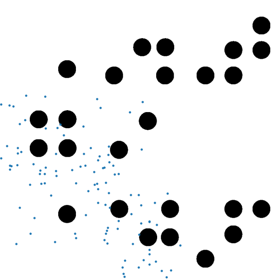
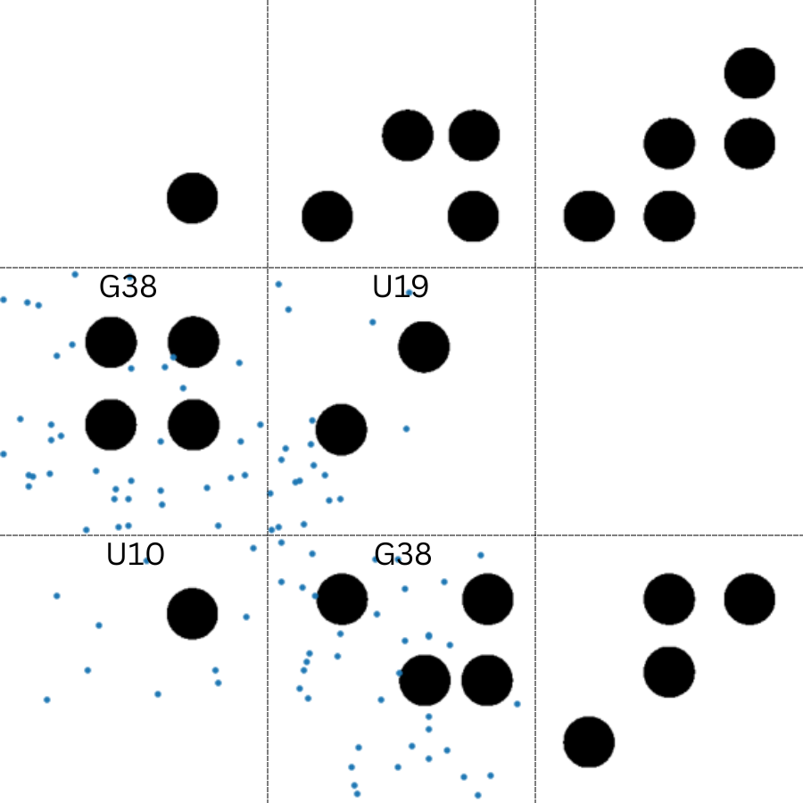

# Dynamic-Sampling-using-Workspace-Segmentation
Learn the parameters of a motion planner from a generated training dataset and implement on a larger test map using 2D workspace segmentation

# Abstract
Diverse sampling techniques are commonly employed in probabilistic planning approaches to determine paths. However, no single sampling method universally excels in all scenarios. Challenges arise when existing sampling methods underperform across an entire map. In response, we propose a novel solution by partitioning the workspace and employing distinct sampling methods in different map segments. Leveraging machine learning, our approach identifies the most effective sampling method for each map segment, resulting in a non-uniform dynamic sampling strategy. This innovative method eliminates the need for oversampling across the entire map, offering an efficient path-finding solution. The project involved an N-Link chain as the robotic model.

# Non Uniform Sampling Output
Based on the training data, the model provided the number of nodes and sampling methods for each section of the map. The resulting sampling is shown in the following figure. While the initial impression may be that the sampling process is arbitrary (Left figure), a closer examination(Right figure) reveals a structured division of samples based on model-informed data. The labeled segments in the figure are denoted as U10, G38, and U19, representing Uniform sampling with 10 samples, Gaussian sampling with 38 samples, and Uniform sampling with 19 samples, respectively. This discernible pattern underscores the strategic integration of sampling methods tailored to specific obstacle scenarios as guided by the model-derived insights.

<kbd></kbd>&nbsp;&nbsp;&nbsp;&nbsp<kbd></kbd>

# Code
/Code contains the code for the project. It is divided in two parts:
1. Sampling and Testing
2. CNN for Obstacle Classification.
Each folder has a Readme file with instructions to execute the respective code.

# Report
/Report contains the complete report of the project. The entire project is explained with each detail in the report.
